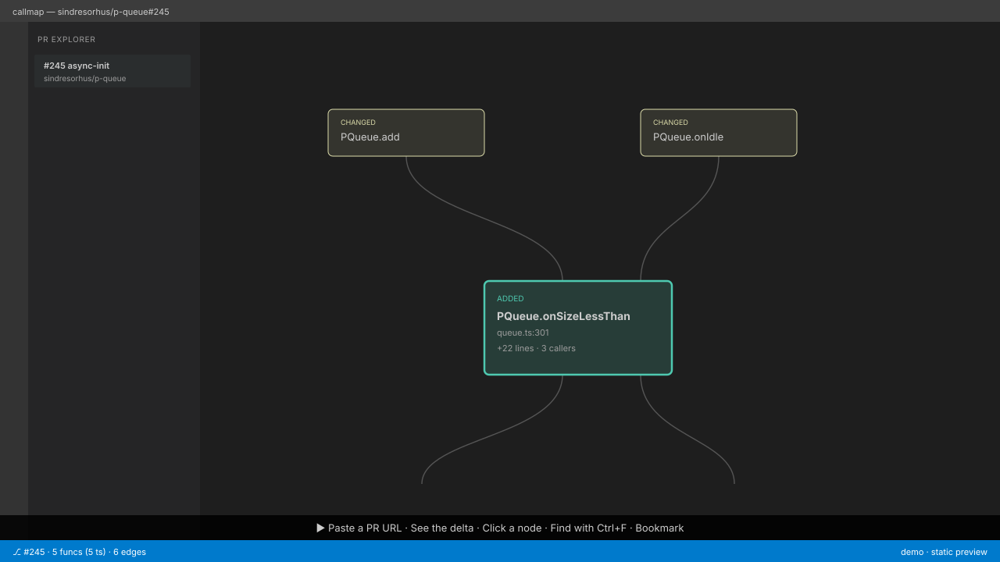

<div align="center">

# callmap

**See what a pull request actually changes.**

[](https://github.com/eugine8248/callmap/actions/workflows/ci.yml)
[](LICENSE)
[](https://github.com/sponsors/eugine8248)
[](https://marketplace.visualstudio.com/items?itemName=callmap.callmap)
[](https://github.com/eugine8248/callmap/releases/latest)



</div>

callmap is a focused callgraph viewer for code reviewers. Paste a GitHub PR
URL, and it draws only the slice of code that PR touches — added, removed,
and changed functions, plus their direct callers and callees. The colours
match VS Code's diff palette so meaning is instant. No telemetry. No
analytics. MIT.

---

## Features that matter

- **PR-delta first** — green for added, red-ghosted for removed, amber for
  changed, neutral for the one-hop neighbours. Whole-repo callgraphs are
  great for archaeology. This one is built for the review minute.
- **Multi-language via tree-sitter** — TypeScript, JavaScript, Python, Go
  today. Grammars are WASM, lazy-loaded per language. A JS-only PR never
  pays for the Python parser.
- **Two shells, one engine** — a 2 MB Tauri desktop installer and a 644 KB
  VS Code extension share the same `@callmap/core` package. The VS Code
  build reuses the host's GitHub session, so there's no PAT to copy.

## Install

### VS Code

```bash
code --install-extension callmap.callmap
```

Or grab the latest `.vsix` from the
[Releases page](https://github.com/eugine8248/callmap/releases/latest) and
install offline.

### Desktop

Download the installer for your platform from the
[Releases page](https://github.com/eugine8248/callmap/releases/latest):

| Platform | File                            | Size   |
| -------- | ------------------------------- | ------ |
| Windows  | `callmap_1.0.0_x64-setup.exe`   | ~2 MB  |
| Windows  | `callmap_1.0.0_x64.msi`         | ~2.6 MB |
| macOS    | `callmap_1.0.0_universal.dmg`   | ~7 MB  |
| Linux    | `callmap_1.0.0_amd64.AppImage`  | ~5 MB  |

v1.0 installers are unsigned; SmartScreen / Gatekeeper will warn on first
launch. Code-signing lands in v1.1. See [SECURITY.md](SECURITY.md).

## How it works

1. Parse the PR URL → fetch metadata, base SHA, head SHA, and the full
   paginated changed-files list via the GitHub REST API.
2. For each touched `.ts/.tsx/.js/.jsx/.py/.go` file, fetch both base and
   head versions and parse with `web-tree-sitter` (in a Web Worker) to
   extract function declarations and call sites — class methods and Go
   receiver methods are name-qualified.
3. Diff per-file function sets, classify each function (added / removed /
   changed / unchanged), build a PR-wide symbol table, resolve every call
   site against it, trim to the one-hop neighbourhood, lay out with
   `dagre`, render with `xyflow`.

The full pipeline is in
[`packages/core/src/callgraphBuilder.ts`](packages/core/src/callgraphBuilder.ts).

## Roadmap

See the [changelog page](https://eugine8248.github.io/callmap/changelog/)
on the docs site for the full v0.1 → v1.0 history. What's next:

- **v1.1** — Code-signed installers (Windows EV + Apple Developer)
- **v1.x** — Rust + Java parsers, import-graph aware cross-file resolution,
  one-hop external callee fetching
- **v2.x** — Optional AI-generated function summaries

[NEEDS_APPROVAL.md](NEEDS_APPROVAL.md) lists items waiting on the
maintainer (marketplace publisher, domain, launch timing).

## Develop locally

```bash
git clone https://github.com/eugine8248/callmap.git
cd callmap
npm install

npm run typecheck         # tsc --noEmit across every workspace
npm run build             # build engine + ui + desktop webview + vscode

# Desktop
npm run dev:desktop       # web dev mode (no native window)
npm run tauri:dev         # desktop dev window (Rust 1.95+)
npm run tauri:build       # produce installer

# VS Code extension
npm run build:vscode      # build webview + extension host
npm run package:vscode    # produce packages/vscode/callmap-1.0.0.vsix

# Docs site
npm run dev:site          # http://localhost:4321
npm run build:site        # output to packages/site/dist
```

See [CONTRIBUTING.md](CONTRIBUTING.md) for the full developer guide,
including how to add a new language parser.

## License

MIT — see [LICENSE](LICENSE). No telemetry, no analytics, no third-party
CDN except `api.github.com`.

If callmap saves you time on reviews and you'd like to support the work:
[Sponsor on GitHub](https://github.com/sponsors/eugine8248).
